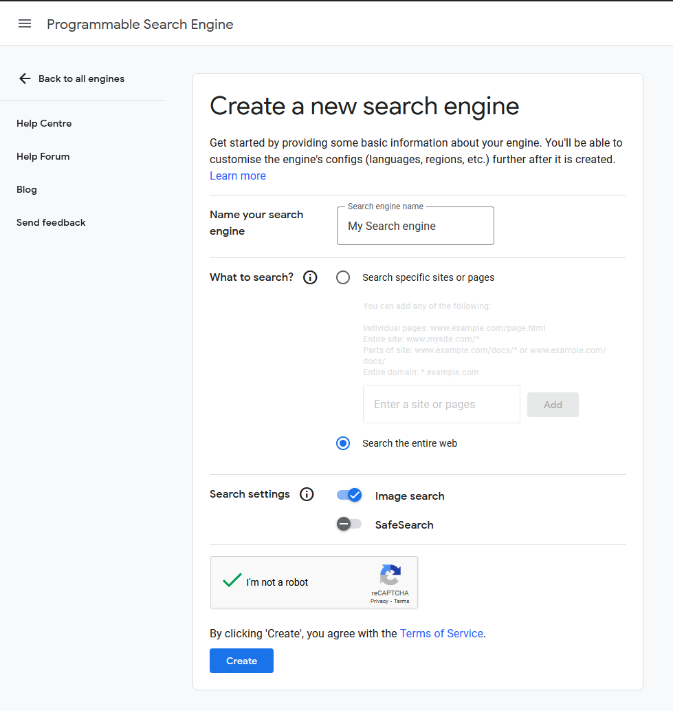
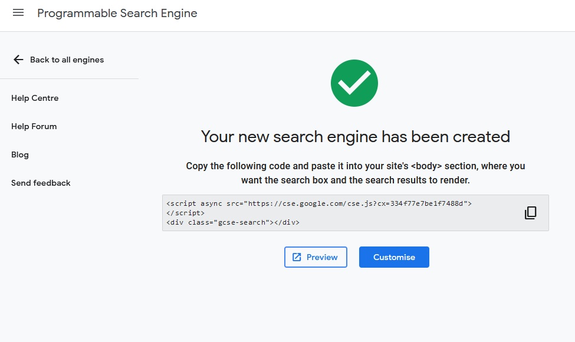
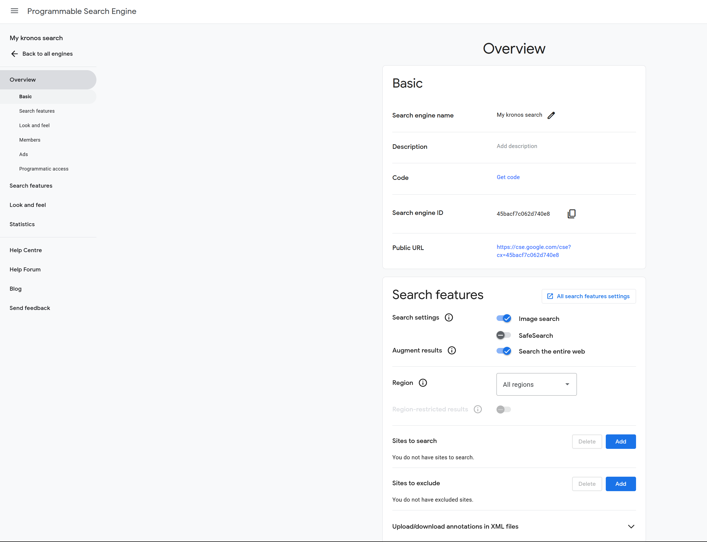
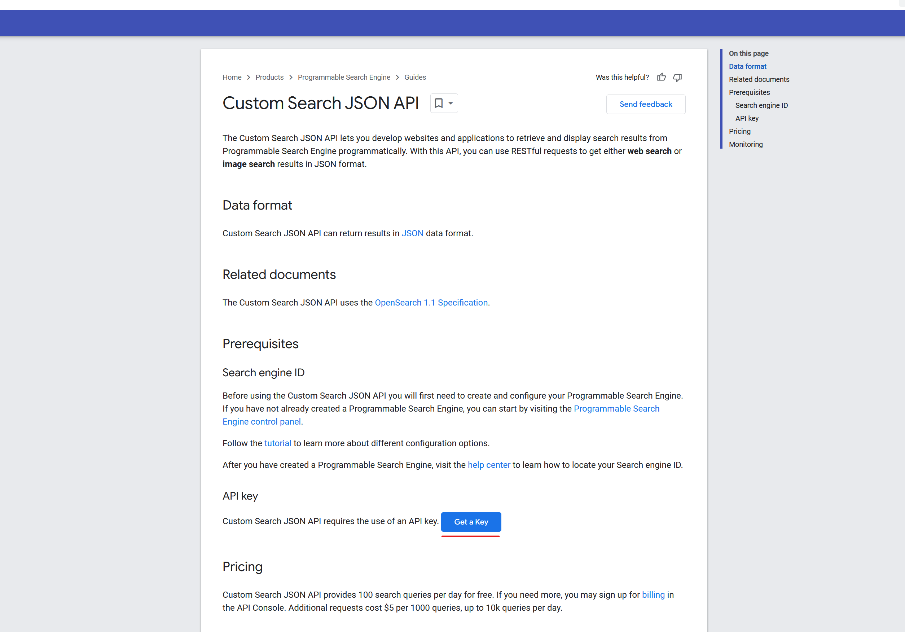
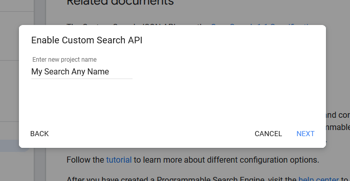
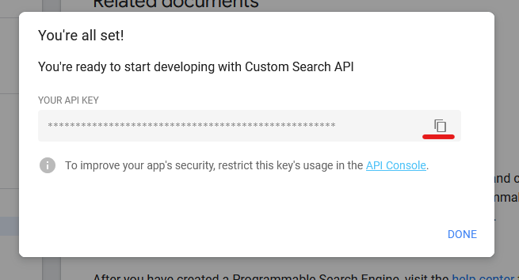

<h1> Google Api Key Setup Tutorial </h1>

You can signup for a api key in the google developer console dashboard to use with kronos image search. This will provide 100 free image searches per day.
This is slightly faster than without and can be used in the case that image search stops functioning correctly until I release an update.

 

- 1  Head to <a href='https://programmablesearchengine.google.com/controlpanel/all'>here</a>
, then press 'Add' to make a new search engine

- 2  Configure settings for search(safesearch etc). Turn ON Image search and Search the entire web. Then press 'Create'. 

{: style="height:75%;width:75%"}

- 3 Hit 'Customize' after it is created.

{: style="height:75%;width:75%"}

- 3 Copy the 'Search Engine Id' and use that as the search engine id in kronos prefs

{: style="height:75%;width:75%"}

 

- 4 Head to <a href ='https://developers.google.com/custom-search/v1/overview'>here</a>  Press 'Get a api key'. Create a new project with any name.

{: style="height:75%;width:75%"}

{: style="height:75%;width:75%"}

- 5 Copy the 'Api Key' with the copy button and insert it into kronos in the preferences.

{: style="height:75%;width:75%"}
