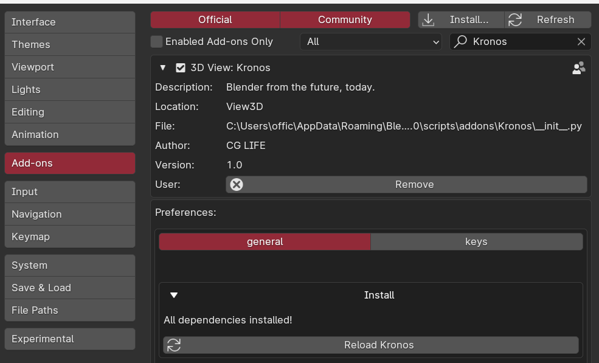

# Install

<!-- 3 step install: -->

- 1   Run Blender as administrator. Download/install kronos.zip using the 'install' button in Blender preferences (EDIT > PREFERENCES > ADDONS > KRONOS).
&NewLine;  
&NewLine;
- 2    Enable Kronos in the addon settings. In the Kronos settings, under 'Install', press the 'Install' button.
&NewLine;  
&NewLine;
- 3    Press the 'Reload Kronos' button after seeing 'Dependencies installed successfully'.
