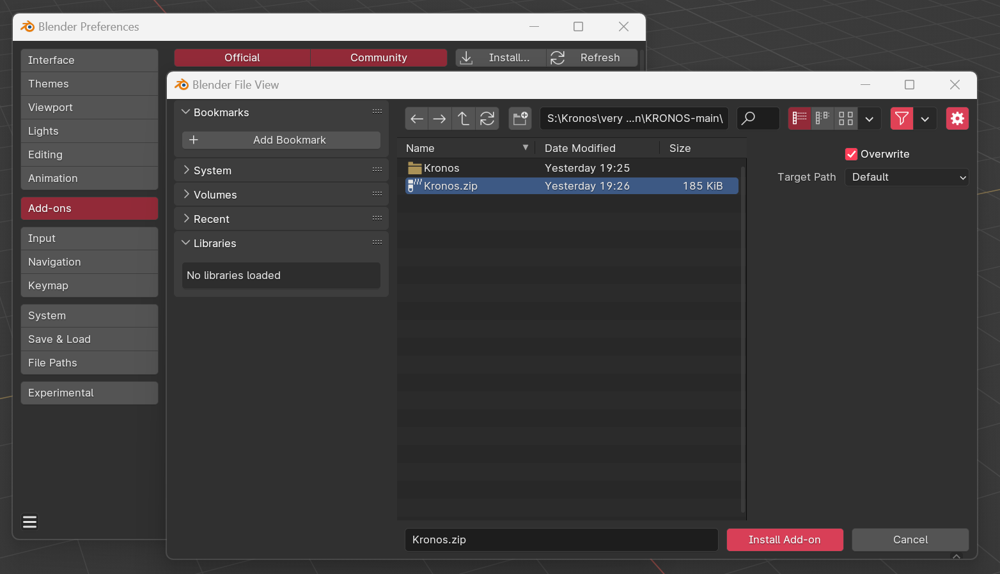

# Install

<!-- 3 step install: -->

<!-- 
 -->
{: style="height:75%;width:75%"}

- 1   Run Blender as administrator. Download/install kronos.zip using the 'install' button in Blender preferences (EDIT > PREFERENCES)

{: style="height:75%;width:75%"}

- 2    Enable the Kronos checkbox. In the Kronos settings, under 'Install', press the 'Install' button.

{: style="height:75%;width:75%"}

- 3    Press the 'Reload Kronos' button after seeing 'Dependencies installed successfully'.
