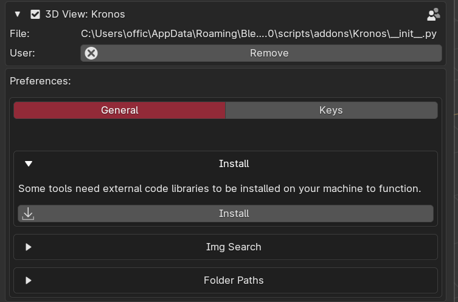

<h1> Install </h1>

<video controls autoplay loop muted style="width: 220%;">
  <source src="/gifs/Installation.mp4" type="video/mp4">
</video>

 
<!-- 
{: style="height:75%;width:75%"} -->

- 1   Run Blender as administrator. Download/install kronos.zip using the 'install' button in Blender preferences. DO NOT EXTRACT THE FILE, LEAVE AS .ZIP

<!-- {: style="height:75%;width:75%"} -->

- 2    Enable the Kronos checkbox(click ONCE and wait for it to enable). In the Kronos settings, under 'Install', press the 'Install' button. Internet connection is required.

<!-- {: style="height:75%;width:75%"} -->

- 3    Press the 'Reload Kronos' button after seeing 'Dependencies installed successfully'.
