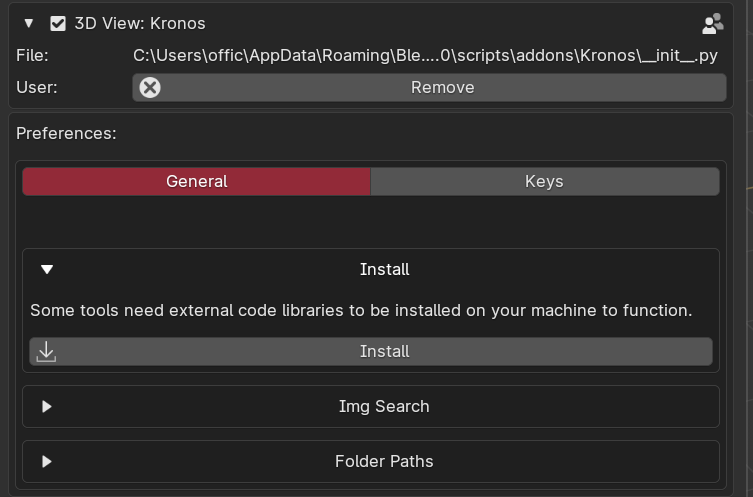

<h1> Install Dependencies</h1>

{: style="height:75%;width:75%"}

<h3>What am I installing and why?</h3>

Plyer - Used by render without GUI to send a toast notification to your OS on render finish

BQT - Allows for using QT gui within blender, this is used for the image search tool to display a custom image window.

qtpy - Required for BQT

Pyside6 - Required for BQT

pyobjc/iterm2 - Mac only, Required for BQT

pygetwindow - Used by image search to determine wether the window needs to be minimized or not.

BS4 - Used for downloading images for image search

Requests - Used for downloading images for image search

 
File path for installing dependencies is Kronos\addon\operator\prefs\install_dependencies.py, if you would like to confirm yourself.