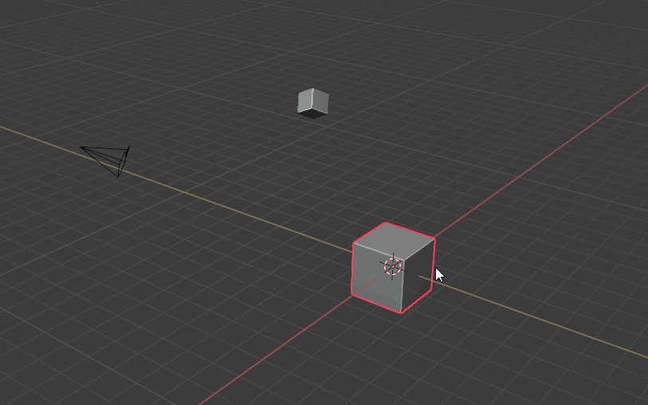

# Origin To Selected

Sets the current active object's origin point to the average of the currently selected geometry in edit mode.

<video controls autoplay loop muted style="width: 150%;">
  <source src="/gifs/vid.mp4" type="video/mp4">
</video>

