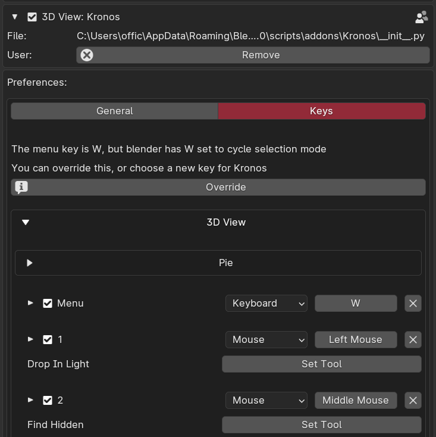

<h1> Main menu key not working </h1>

{: style="height:50%;width:50%"}

To ensure kronos takes priority of the W tool, you can click  'override' to swap the default 'W' swap selection tool for kronos menu.
 
Else you can set your own keybind in the preferences.
 
Ensure the menu is a key one of your fingers rests on. This prevents moving your fingers,
resulting in speed like never before.

<h1> SUPPORT </h1>

Contact me at officialcglife @gmail.com for support enquiries.

