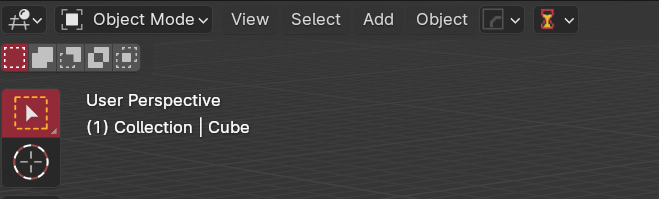
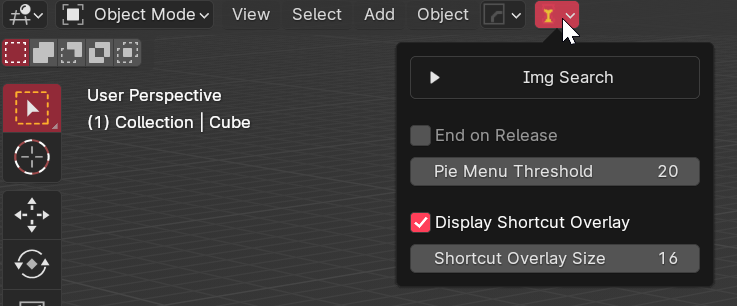
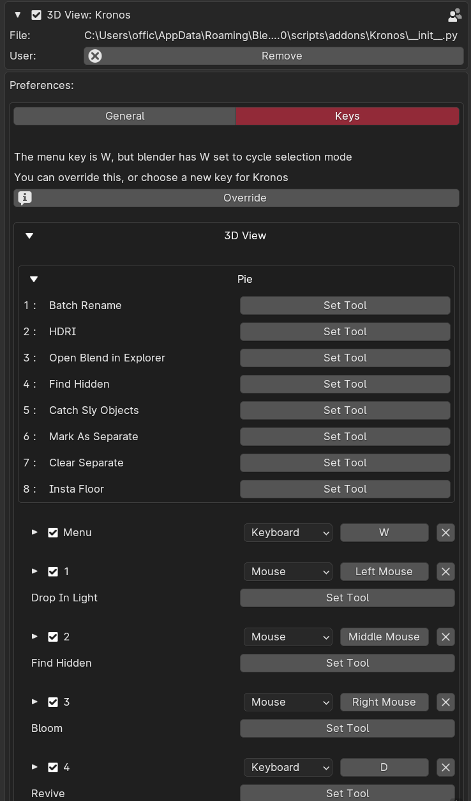

<h1> Tips </h1>

## Help Shortcuts

Shift + left click any tool to bring up it's page on this doc site.

## Header Menu

{: style="height:50%;width:50%"}

{: style="height:75%;width:75%"}

Checkout the header menu in the top of the 3d viewport, it has helpful settings that can be changed on the fly.

## Addon Prefs

{: style="height:75%;width:75%"}

Check the Kronos addon preferences, there are many options you can set, including setting every tool + hotkey,
and default tool values as well as important file paths.
