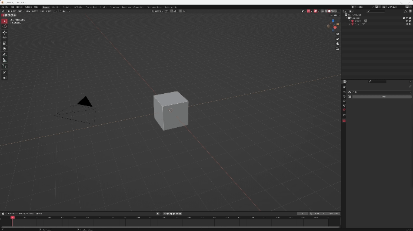

# Install

<!-- 3 step install: -->

- 1   Open Blender as an administrator. Download and install kronos.zip using the 'install' button in Blender preferences (EDIT > PREFERENCES > ADDONS).
&NewLine;  
&NewLine;
&NewLine;  
&NewLine;
- 2    Enable Kronos in the addon settings. In the Kronos settings, go to 'Setup' and press 'Install Dependencies'.
&NewLine;  
&NewLine;
&NewLine;  
&NewLine;
- 3    Restart Blender after seeing 'Dependencies installed successfully'.
